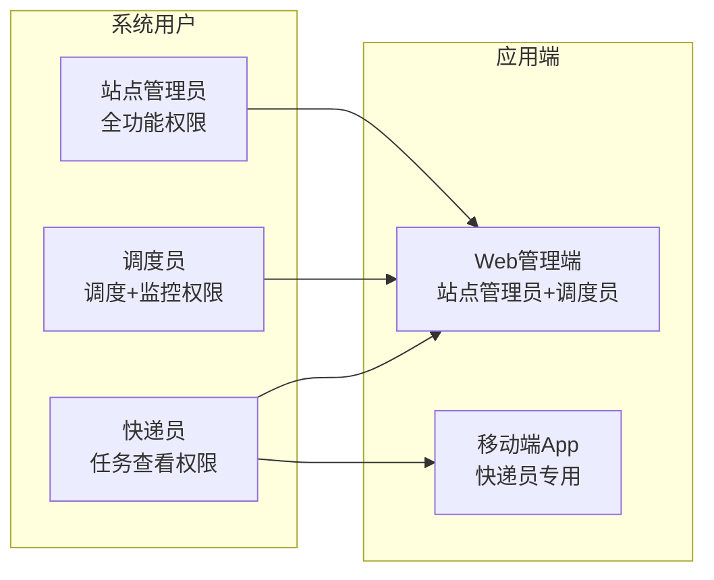

# 快递末端配送系统 - 现代化前端界面设计方案

> **设计理念**: 以数据驱动决策、AI辅助调度、实时监控反馈为核心的现代化配送管理平台
> **设计风格**: Fluent Design + 玻璃拟态 + 亮色主题支持
> **交互特色**: 拖拽式操作 + 智能推荐 + 实时协同

---

## 目录

1. [整体设计架构](#整体设计架构)
2. [详细页面设计](#详细页面设计)
3. [现代化设计特色](#现代化设计特色)
4. [技术实现要点](#技术实现要点)

---

## 🎨 整体设计架构

### 用户角色与权限设计



### 导航架构设计

**侧边栏导航（可收起）**:
```
🏠 智能工作台     📊 数据总览 + 快速操作
🤖 AI调度中心     🧠 核心算法调度功能
📦 包裹流转中心   📋 包裹全生命周期管理
👥 快递员工作台   🚚 快递员管理 + 绩效分析
🗺️ 实时监控地图   📍 配送实时跟踪
📈 配送分析中心   📊 数据分析 + 效果评估
🛣️ 路线优化历史   📚 历史记录 + 算法优化
⚙️ 系统设置      🔧 基础配置 + 用户管理
```

---

## 📱 详细页面设计

### 1. 🏠 智能工作台 (Dashboard)

**设计特色**: 数据可视化驱动的智能决策中心

#### 页面布局
```
┌─────────────────────────────────────────────────────────────┐
│ 欢迎回来，张站长 👋    今日 2026年1月13日 周一 ☀️ 晴        │
├─────────────────────────────────────────────────────────────┤
│ 🚀 快速操作面板                                              │
│ [📦 新建调度] [📋 扫描入库] [👀 实时监控] [📊 生成报告]      │
├─────────────────────────────────────────────────────────────┤
│ 📊 今日概览                    │ 🔥 实时状态                │
│ ┌─────────┬─────────┬─────────┐│ ┌──────────────────────────┐ │
│ │ 待配送   │ 配送中   │ 已完成   ││ │ 🟢 5个快递员在线          │ │
│ │ 127     │ 85      │ 342     ││ │ 🟡 3条路线进行中          │ │
│ │ 包裹     │ 包裹     │ 包裹     ││ │ 🔴 2个包裹异常需处理      │ │
│ └─────────┴─────────┴─────────┘│ │ ⚡ AI调度节省25.3km       │ │
├─────────────────────────────────┤ └──────────────────────────┘ │
│ 📈 配送效率趋势 (近7天)          │ 🏆 快递员排行榜              │
│ [折线图显示每日配送量和效率]     │ 1. 李师傅 ⭐⭐⭐⭐⭐      │
│                                │ 2. 王师傅 ⭐⭐⭐⭐        │
│                                │ 3. 陈师傅 ⭐⭐⭐          │
├─────────────────────────────────┴─────────────────────────────┤
│ 🎯 智能建议                                                   │
│ • 建议在10:30前完成上午批次调度，避开交通高峰期               │
│ • 检测到东区包裹密度较高，建议增加1名快递员                   │
│ • 昨日路径优化效果显著，平均每条路线节省3.2公里               │
└─────────────────────────────────────────────────────────────┘
```

#### 核心功能
1. **一键操作面板**: 最常用功能的快速入口
2. **数据概览卡片**: 关键指标的实时展示
3. **趋势分析图表**: 配送效率、成本趋势
4. **智能建议引擎**: AI分析生成优化建议
5. **快递员状态监控**: 实时工作状态和排行榜

### 2. 🤖 AI调度中心 (Smart Dispatch)

**设计特色**: 可视化的智能调度工作流，AI辅助决策

#### 页面布局
```
┌─────────────────────────────────────────────────────────────┐
│ 🤖 AI智能调度中心                     [🔄 自动调度] [⚡ 手动优化] │
├─────────────────────────────────────────────────────────────┤
│ 📋 调度配置面板                    │ 🗺️ 预览地图                │
│ ┌─────────────────────────────────┐│ ┌──────────────────────── │
│ │ 📅 调度批次: 2026-01-13 上午批    ││ │ [交互式地图显示]         │
│ │ 📦 包裹数量: 127个               ││ │ • 包裹分布点            │
│ │ 🚚 可用快递员: 5人               ││ │ • 聚类结果预览          │
│ │ ⚙️ 算法设置:                   ││ │ • 路径规划预览          │
│ │   K-Means聚类数: [5] ⚙️        ││ │                         │
│ │   遗传算法代数: [500] ⚙️        ││ │ 🎯 点击包裹查看详情      │
│ │   优化目标: [最短距离] ⬇️       ││ │ 🖱️ 拖拽调整分区         │
│ │                                ││ │                         │
│ │ [🚀 开始AI调度]                 ││ │                         │
│ └─────────────────────────────────┘│ └──────────────────────── │
├─────────────────────────────────────┴─────────────────────────┤
│ 🎯 调度进度 & 算法执行状态                                     │
│ ┌─────────────────────────────────────────────────────────────┐│
│ │ 第1阶段: K-Means聚类分析 ✅ 完成 (用时2.3s)                ││
│ │ 第2阶段: 遗传算法路径优化 🔄 进行中... 45% (预计剩余8s)    ││
│ │ 第3阶段: 路径几何计算 ⏳ 等待中                            ││
│ └─────────────────────────────────────────────────────────────┘│
├─────────────────────────────────────────────────────────────┤
│ 📊 实时优化结果                                              │
│ [分区结果表格] [路线详情] [优化效果对比]                       │
└─────────────────────────────────────────────────────────────┘
```

#### 创新功能
1. **拖拽式调度**: 直接在地图上拖拽调整包裹分配
2. **算法参数实时调整**: 滑块调整K值、GA参数，实时预览效果
3. **分阶段进度显示**: 清晰展示算法执行的各个阶段
4. **优化效果对比**: 新旧路径的效果对比可视化
5. **一键应用**: 优化完成后一键应用到实际调度

### 3. 📦 包裹流转中心 (Package Flow Center)

**设计特色**: 包裹全生命周期的可视化管理

#### 页面布局
```
┌─────────────────────────────────────────────────────────────┐
│ 📦 包裹流转中心           🔍[搜索快递单号/收件人]   [📊 筛选器] │
├─────────────────────────────────────────────────────────────┤
│ 📈 包裹流转状态总览                                           │
│ [📥入库:45] → [📋分拣:23] → [🚚配送中:87] → [✅已送达:342]    │
├─────────────────────────────────────────────────────────────┤
│ 🚀 快速操作                                                  │
│ [📱扫码入库] [📋批量导入] [🎯智能分拣] [📊生成配送单]          │
├─────────────────────────────────────────────────────────────┤
│ 📋 包裹列表 (智能表格)                                        │
│ ┌───────┬──────────┬─────────┬─────────┬─────────┬──────────┐ │
│ │快递单号 │ 收件人    │ 收件地址 │ 状态    │ 快递员   │ 操作     │ │
│ ├───────┼──────────┼─────────┼─────────┼─────────┼──────────┤ │
│ │YT0123 │ 张三      │浦东新区  │🚚配送中  │李师傅    │[👀详情]  │ │
│ │SF0456 │ 李四      │黄浦区   │📋待分拣  │未分配    │[🎯分配]  │ │
│ │JD0789 │ 王五      │静安区   │✅已送达  │陈师傅    │[📞回访]  │ │
│ └───────┴──────────┴─────────┴─────────┴─────────┴──────────┘ │
├─────────────────────────────────────────────────────────────┤
│ 📍 地图视图切换                 📊 数据统计面板               │
│ [🗺️ 包裹分布地图]              [📈 今日入库趋势]            │
│                               [⏱️ 平均处理时长]            │
└─────────────────────────────────────────────────────────────┘
```

#### 核心功能
1. **扫码快速入库**: 支持批量扫描，自动识别快递单信息
2. **智能地址解析**: AI自动解析地址并获取坐标
3. **包裹状态流**: 可视化显示包裹在不同阶段的流转
4. **异常包裹预警**: 超时、地址错误等异常情况智能提醒
5. **批量操作**: 支持批量分配、批量状态更新

### 4. 👥 快递员工作台 (Courier Workbench)

**设计特色**: 以人为中心的工作效率管理平台

#### 页面布局
```
┌─────────────────────────────────────────────────────────────┐
│ 👥 快递员工作台                          [➕ 添加快递员] [📊 绩效分析] │
├─────────────────────────────────────────────────────────────┤
│ 🔥 实时状态监控                                              │
│ ┌──────────────────────────────────────────────────────────┐ │
│ │ 🟢在线 李师傅    📍浦东区域   📦15/20   ⏱️预计2小时完成     │ │
│ │ 🟢在线 王师傅    📍黄浦区域   📦12/18   ⏱️预计1.5小时完成   │ │
│ │ 🟡忙碌 陈师傅    📍静安区域   📦8/15    ⏱️预计1小时完成     │ │
│ │ 🔴离线 赵师傅    📍徐汇区域   📦0/0     ⏹️已下班           │ │
│ │ 🟢在线 刘师傅    📍长宁区域   📦20/25   ⚠️超负荷运转       │ │
│ └──────────────────────────────────────────────────────────┘ │
├─────────────────────────────────────────────────────────────┤
│ 📊 工作负载均衡分析            │ 🏆 本周绩效排行                │
│ ┌─────────────────────────────┐│ ┌──────────────────────────────┐│
│ │ [雷达图显示各快递员负载]     ││ │ 1. 李师傅  98.5分 🥇         ││
│ │ • 包裹数量                  ││ │ 2. 陈师傅  95.2分 🥈         ││
│ │ • 配送距离                  ││ │ 3. 王师傅  92.8分 🥉         ││
│ │ • 工作时长                  ││ │ 4. 刘师傅  89.1分           ││
│ │ • 客户满意度                ││ │ 5. 赵师傅  85.7分           ││
│ └─────────────────────────────┘│ └──────────────────────────────┘│
├─────────────────────────────────┴─────────────────────────────┤
│ 🎯 智能调度建议                                               │
│ • 建议将刘师傅的5个包裹转移给陈师傅，均衡工作负载             │
│ • 李师傅在浦东区域熟悉度最高，建议优先分配该区域包裹           │
│ • 检测到王师傅今日配送效率提升15%，可适当增加工作量           │
└─────────────────────────────────────────────────────────────┘
```

#### 创新功能
1. **实时状态监控**: GPS位置、工作进度、预计完成时间
2. **工作负载可视化**: 雷达图展示多维度工作负载
3. **智能负载均衡**: AI建议工作量分配调整
4. **绩效积分系统**: 综合评分体系激励快递员
5. **疲劳度监控**: 基于工作时长和强度的疲劳预警

### 5. 🗺️ 实时监控地图 (Real-time Map Monitor)

**设计特色**: 沉浸式实时监控，支持多图层展示

#### 页面布局
```
┌─────────────────────────────────────────────────────────────┐
│ 🗺️ 实时监控地图                    [🔄 刷新] [⚙️ 图层设置] [📸 截图] │
├─────────────────────────────────────────────────────────────┤
│ 🎛️ 控制面板                      │ 📍 监控信息面板              │
│ ┌─────────────────────────────────┐│ ┌──────────────────────── │
│ │ 📊 图层控制                     ││ │ 🎯 选中快递员: 李师傅     │
│ │ ☑️ 快递员位置                   ││ │ 📍 当前位置: 浦东大道123号 │
│ │ ☑️ 配送路径                     ││ │ 📦 剩余包裹: 3个          │
│ │ ☑️ 包裹分布                     ││ │ ⏱️ 预计完成: 14:30       │
│ │ ☑️ 交通状况                     ││ │ 🚗 行驶速度: 25km/h      │
│ │ ☑️ 配送区域                     ││ │ 📞 一键通话: [📱呼叫]     │
│ │                                ││ │                         │
│ │ ⏱️ 刷新频率: [30秒] ⚙️          ││ │ 🚨 异常提醒              │
│ │ 📅 时间范围: [今日] 📅          ││ │ • 王师傅超时15分钟       │
│ │                                ││ │ • 3个包裹地址需确认      │
│ │ [🎮 全屏模式] [📺 投屏]         ││ │                         │
│ └─────────────────────────────────┘│ └──────────────────────── │
├─────────────────────────────────────┴─────────────────────────┤
│                     🗺️ 交互式地图区域                          │
│                                                               │
│  [地图显示所有快递员实时位置、路径轨迹、包裹分布等信息]          │
│                                                               │
│  • 🟢 快递员实时位置（带头像和姓名）                           │
│  • 🛣️ 配送路径（彩色线条，不同颜色代表不同快递员）             │
│  • 📦 包裹位置（待配送、配送中、已送达用不同图标）             │
│  • 🏢 配送站位置                                              │
│  • 🚦 实时交通状况                                            │
└─────────────────────────────────────────────────────────────┘
```

#### 特色功能
1. **多图层叠加**: 快递员、路径、包裹、交通等多图层
2. **实时轨迹回放**: 支持历史轨迹回放和分析
3. **地理围栏**: 设置配送区域边界，异常位置报警
4. **热力图分析**: 包裹密度热力图，优化区域划分
5. **一键通讯**: 直接在地图上与快递员语音/文字通讯

### 6. 📈 配送分析中心 (Delivery Analytics)

**设计特色**: 深度数据分析，AI洞察驱动决策优化

#### 页面布局
```
┌─────────────────────────────────────────────────────────────┐
│ 📈 配送分析中心         📅 [本周] [本月] [自定义]  📊 [导出报告] │
├─────────────────────────────────────────────────────────────┤
│ 🎯 核心指标 KPI                                              │
│ ┌─────────┬─────────┬─────────┬─────────┬─────────┬─────────┐ │
│ │ 配送效率 │ 路径优化 │ 客户满意 │ 成本节省 │ 准时率  │ 投诉率  │ │
│ │ 94.2%   │ 26.5%   │ 4.8/5   │ ￥1,240 │ 98.1%  │ 0.3%   │ │
│ │ 📈+2.1% │ 📈+5.3% │ 📈+0.2  │ 📈+￥320│ 📊-0.1%│ 📉-0.1%│ │
│ └─────────┴─────────┴─────────┴─────────┴─────────┴─────────┘ │
├─────────────────────────────────────────────────────────────┤
│ 🧠 AI算法效果分析              │ 📊 配送趋势预测              │
│ ┌─────────────────────────────┐│ ┌──────────────────────────┐ │
│ │ K-Means聚类效果:             ││ │ [时序图显示]              │ │
│ │ • 平均聚类内距离: 2.1km      ││ │ • 未来7天包裹量预测       │ │
│ │ • 聚类边界清晰度: 92%        ││ │ • 配送高峰时段预测        │ │
│ │                             ││ │ • 最佳快递员配置建议      │ │
│ │ 遗传算法优化效果:            ││ │                          │ │
│ │ • 路径缩短: 平均26.5%        ││ │ 🔮 明日建议:             │ │
│ │ • 收敛代数: 平均342代        ││ │ 预计包裹145个，建议6人    │ │
│ │ • 算法执行时间: 8.2s        ││ │                          │ │
│ └─────────────────────────────┘│ └──────────────────────────┘ │
├─────────────────────────────────┴─────────────────────────────┤
│ 🗺️ 区域配送热力分析                                           │
│ [上海市地图 + 包裹密度热力图 + 配送效率颜色编码]                │
│ • 红色区域: 高密度高效率  • 橙色区域: 高密度低效率            │
│ • 绿色区域: 低密度高效率  • 蓝色区域: 低密度低效率            │
└─────────────────────────────────────────────────────────────┘
```

#### 分析维度
1. **算法效果分析**: K-Means聚类质量、GA收敛效果评估
2. **配送效率分析**: 路径优化效果、时间成本分析
3. **区域洞察**: 不同区域的配送特征和优化建议
4. **预测分析**: 基于历史数据的需求预测和资源配置建议
5. **对比分析**: 使用AI调度 vs 人工调度的效果对比

### 7. 🛣️ 路线优化历史 (Route Optimization History)

**设计特色**: 算法迭代优化的可追溯分析平台

#### 页面布局
```
┌─────────────────────────────────────────────────────────────┐
│ 🛣️ 路线优化历史                          🔍 [搜索] [🔄 同步] [⭐ 收藏] │
├─────────────────────────────────────────────────────────────┤
│ 📚 优化记录时间轴                                             │
│ ┌─────────────────────────────────────────────────────────────┐│
│ │ 📅 2026-01-13 09:30  ⚡AI调度  📦127个包裹  🚚5名快递员   ││
│ │   算法: K-Means(K=5) + GA(500代)  ⏱️ 用时12.3s             ││
│ │   效果: 节省距离32.1km  💰节省成本￥156                     ││
│ │   状态: ✅已执行  [📋详情] [🔄重新优化] [📊分析]           ││
│ ├─────────────────────────────────────────────────────────────┤│
│ │ 📅 2026-01-12 14:15  ⚡AI调度  📦89个包裹   🚚4名快递员    ││
│ │   算法: K-Means(K=4) + GA(300代)  ⏱️ 用时8.1s              ││
│ │   效果: 节省距离18.7km  💰节省成本￥89                      ││
│ │   状态: ✅已执行  [📋详情] [🔄重新优化] [📊分析]           ││
│ └─────────────────────────────────────────────────────────────┘│
├─────────────────────────────────────────────────────────────┤
│ 📊 优化详情面板 (点击记录显示)                                │
│ ┌──────────────────┬──────────────────────────────────────────┐│
│ │ 🎯 算法参数       │ 📈 优化过程可视化                        ││
│ │ K-Means:         │ [算法收敛曲线图]                         ││
│ │ • 聚类数: 5      │ • 遗传算法收敛过程                      ││
│ │ • 迭代数: 23     │ • 适应度函数变化                        ││
│ │ • 收敛度: 99.2%  │ • 最优解出现代数                        ││
│ │                  │                                          ││
│ │ 遗传算法:        │ 🗺️ 路径对比                             ││
│ │ • 种群: 100      │ [优化前后路径地图对比]                   ││
│ │ • 代数: 500      │                                          ││
│ │ • 交叉率: 80%    │                                          ││
│ │ • 变异率: 10%    │                                          ││
│ └──────────────────┴──────────────────────────────────────────┘│
└─────────────────────────────────────────────────────────────┘
```

#### 核心功能
1. **算法版本管理**: 不同参数配置的优化结果对比
2. **效果可视化**: 优化前后路径的直观对比
3. **参数调优历史**: 记录不同参数设置的效果，支持A/B测试
4. **收藏夹功能**: 收藏效果好的参数配置供后续使用
5. **一键重现**: 使用历史参数重新执行优化

### 8. ⚙️ 系统设置 (System Settings)

**设计特色**: 模块化配置管理，支持个性化定制

#### 页面布局
```
┌─────────────────────────────────────────────────────────────┐
│ ⚙️ 系统设置                                    [💾 保存配置] [🔄 重置] │
├─────────────────────────────────────────────────────────────┤
│ 📑 配置分类              │ 🛠️ 配置详情                       │
│ ┌─────────────────────┐  │ ┌──────────────────────────────── │
│ │ 🏢 配送站管理        │  │ │ 🏢 配送站信息                   │
│ │ 👥 用户权限管理      │  │ │ 站点名称: [上海浦东配送站] ✏️   │
│ │ 🤖 算法参数配置      │  │ │ 详细地址: [上海市浦东新区...] ✏️│
│ │ 🗺️ 地图服务配置      │  │ │ GPS坐标: [121.5°, 31.2°] 📍   │
│ │ 📱 移动端设置        │  │ │ 服务范围: [50km] ⚙️            │
│ │ 🔔 消息通知设置      │  │ │ 营业时间: [8:00-18:00] ⏰     │
│ │ 🎨 界面主题设置      │  │ │                               │
│ │ 📊 数据备份还原      │  │ │ [🗑️ 删除] [✏️ 编辑] [➕ 新增]    │
│ │ 🔐 安全设置          │  │ └──────────────────────────────── │
│ └─────────────────────┘  │                                  │
├─────────────────────────┴─────────────────────────────────────┤
│ 🤖 算法参数精细调优 (选中时显示)                               │
│ ┌─────────────────────────────────────────────────────────────┐│
│ │ K-Means 聚类参数                                           ││
│ │ • 最大迭代次数: [100] ⚙️   • 收敛阈值: [0.0001] ⚙️         ││
│ │ • 聚类中心约束: [启用] ☑️  • 最大距离: [50km] 📏           ││
│ │                                                           ││
│ │ 遗传算法参数                                              ││
│ │ • 种群大小: [100] 👥      • 进化代数: [500] 🔄            ││
│ │ • 交叉概率: [0.8] ⚙️      • 变异概率: [0.1] ⚙️           ││
│ │ • 精英保留: [10%] 🏆      • 锦标赛大小: [3] 🎯           ││
│ │                                                           ││
│ │ [🧪 参数测试] [📊 性能基准] [🔄 恢复默认] [💾 保存配置]    ││
│ └─────────────────────────────────────────────────────────────┘│
└─────────────────────────────────────────────────────────────┘
```

#### 配置功能
1. **算法参数热调整**: 支持在线调整算法参数并测试效果
2. **多主题支持**: 明亮、暗黑、护眼等多种主题模式
3. **权限精细管理**: 基于角色的权限控制
4. **数据备份**: 自动备份和手动恢复功能
5. **个性化设置**: 用户偏好、快捷键、布局定制

### 9. 📱 移动端快递员App (Courier Mobile App)

**设计特色**: 轻量化、操作简便的快递员专用移动应用

#### 主要界面
```
📱 今日任务              📱 导航配送              📱 包裹详情
┌─────────────────┐    ┌─────────────────┐    ┌─────────────────┐
│ 👋 李师傅，早上好  │    │ 🗺️ [导航地图]    │    │ 📦 快递详情      │
│ ☀️ 今日天气良好   │    │                │    │ 单号: YT123456  │
│                │    │ 📍 下一站:       │    │ 收件人: 张三     │
│ 🎯 今日任务      │    │ 浦东新区...     │    │ 📞 138****5678  │
│ • 待配送: 15个   │    │                │    │ 🏠 浦东新区...  │
│ • 已完成: 8个    │    │ ⏱️ 预计15分钟    │    │ 📋 备注: 公司前台│
│ • 剩余: 7个      │    │ 🚗 最快路线     │    │                │
│                │    │                │    │ [📞 拨打电话]    │
│ [📋 查看列表]    │    │ [🚀 开始导航]   │    │ [✅ 确认送达]   │
│ [📍 开始配送]    │    │ [📞 联系客户]   │    │ [❌ 配送异常]   │
└─────────────────┘    └─────────────────┘    └─────────────────┘
```

#### 移动端特色功能
1. **离线地图**: 支持离线导航，无网络环境下正常工作
2. **语音播报**: 智能语音提醒下一个配送地址
3. **扫码操作**: 快速扫码确认送达状态
4. **轨迹上传**: 实时上传配送轨迹到监控中心
5. **异常反馈**: 一键上报配送异常（客户不在、地址错误等）

---

## 🎨 现代化设计特色

### 视觉设计风格

1. **玻璃拟态 (Glassmorphism)**: 半透明背景、毛玻璃效果
2. **渐变色彩**: 科技感蓝紫渐变色系
3. **微动画**: 悬停效果、加载动画、状态切换动画
4. **响应式布局**: 桌面、平板、手机三端适配
5. **暗色模式**: 支持明暗主题切换

### 交互设计创新

1. **拖拽式操作**: 直接拖拽调整包裹分配
2. **实时协同**: 多用户同时查看配送状态
3. **智能提示**: AI助手提供操作建议
4. **手势操作**: 支持手势缩放、滑动等操作
5. **语音交互**: 语音控制部分功能

### 性能优化

1. **懒加载**: 大数据表格虚拟滚动
2. **数据缓存**: 智能缓存减少API调用
3. **离线支持**: PWA支持离线访问
4. **增量更新**: WebSocket实时数据推送

---

## 🛠️ 技术实现要点

### 前端技术栈

```typescript
// 主要依赖包
{
  "vue": "^3.4.0",
  "vue-router": "^4.2.0",
  "pinia": "^2.1.0",
  "element-plus": "^2.4.0",
  "leaflet": "^1.9.0",
  "echarts": "^5.4.0",
  "typescript": "^5.2.0"
}
```

### 核心组件设计

#### 1. 地图组件 (MapComponent.vue)
```typescript
interface MapProps {
  markers: MapMarker[]     // 地图标记点
  paths: MapPath[]         // 路径数据
  clusters: Cluster[]      // 聚类结果
  interactive: boolean     // 是否可交互
  realtime: boolean        // 是否实时更新
}
```

#### 2. 调度配置组件 (DispatchConfig.vue)
```typescript
interface DispatchConfig {
  packages: Package[]      // 包裹列表
  couriers: Courier[]      // 快递员列表
  station: DeliveryStation // 配送站
  algorithm: {
    kmeans: KMeansConfig
    genetic: GeneticConfig
  }
}
```

#### 3. 实时监控组件 (RealtimeMonitor.vue)
```typescript
interface MonitorData {
  courierPositions: CourierPosition[]  // 快递员位置
  routeProgress: RouteProgress[]       // 路线进度
  alerts: Alert[]                      // 异常提醒
  performance: PerformanceMetrics      // 性能指标
}
```

### 状态管理设计

```typescript
// stores/dispatch.ts
export const useDispatchStore = defineStore('dispatch', () => {
  const currentDispatch = ref<DispatchPlan | null>(null)
  const optimizationHistory = ref<OptimizationRecord[]>([])
  const algorithmConfig = ref<AlgorithmConfig>({
    kmeans: { k: 5, maxIterations: 100 },
    genetic: { populationSize: 100, generations: 500 }
  })

  const startOptimization = async (config: DispatchConfig) => {
    // 启动算法优化逻辑
  }

  return {
    currentDispatch,
    optimizationHistory,
    algorithmConfig,
    startOptimization
  }
})
```

### API 接口设计

```typescript
// API 接口定义
interface DispatchAPI {
  // 调度相关
  POST: '/api/dispatch/optimize'     // 启动优化
  GET:  '/api/dispatch/status/:id'   // 查询状态
  GET:  '/api/dispatch/history'      // 历史记录

  // 实时监控
  GET:  '/api/monitor/couriers'      // 快递员状态
  WS:   '/ws/realtime'               // WebSocket 实时数据

  // 算法配置
  GET:  '/api/algorithm/config'      // 获取算法配置
  PUT:  '/api/algorithm/config'      // 更新算法配置
}
```

---

这个现代化的前端设计方案结合了最新的设计理念和技术实现，既保证了功能的完整性，又提供了优秀的用户体验。你觉得这个设计方向如何？需要针对某个特定页面进一步详细设计吗？