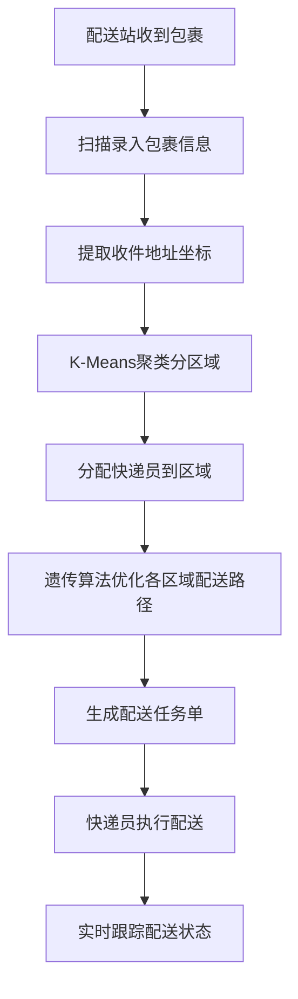
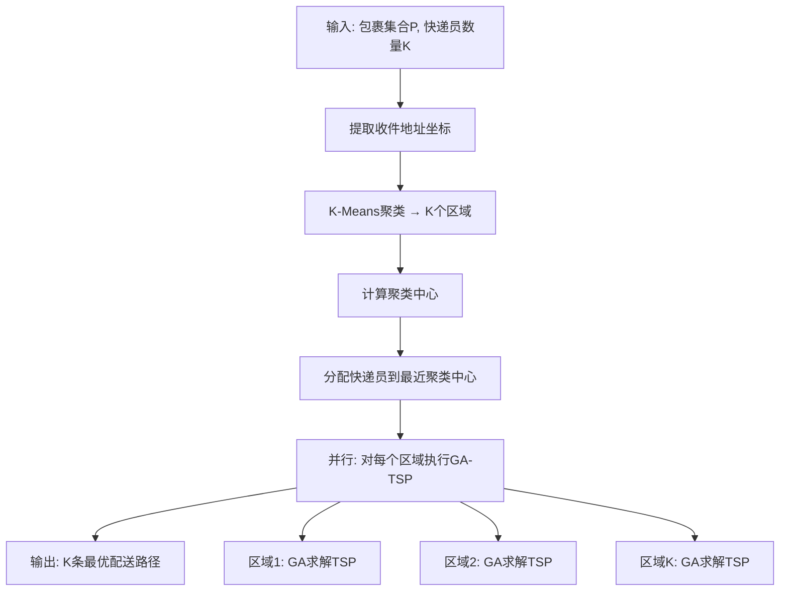
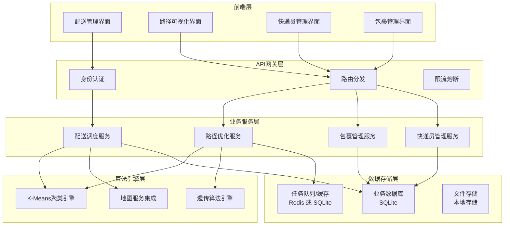
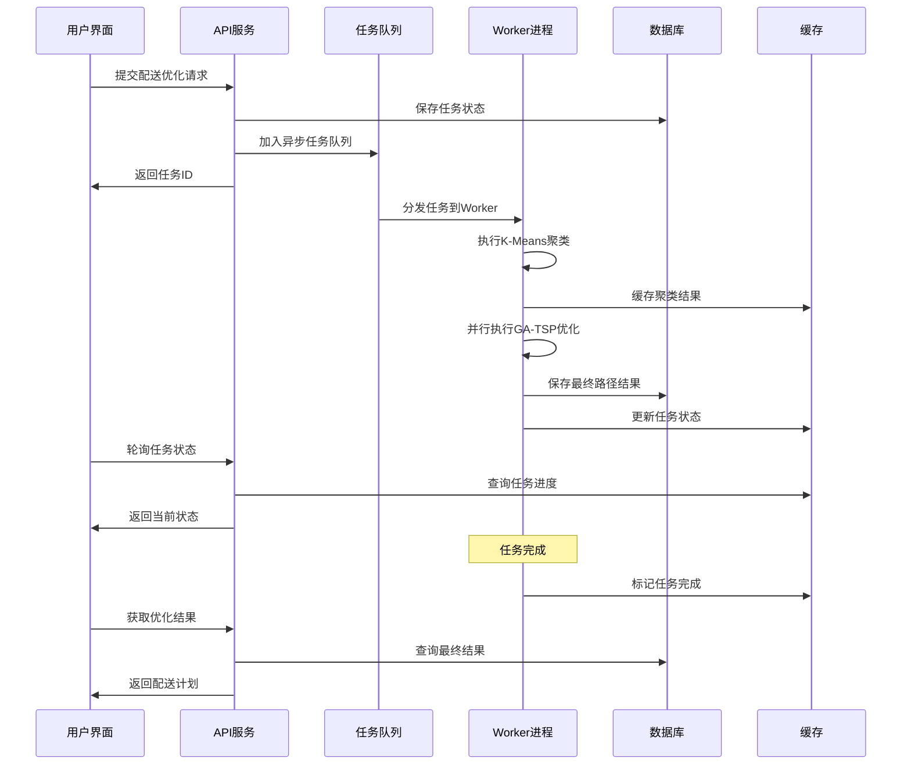
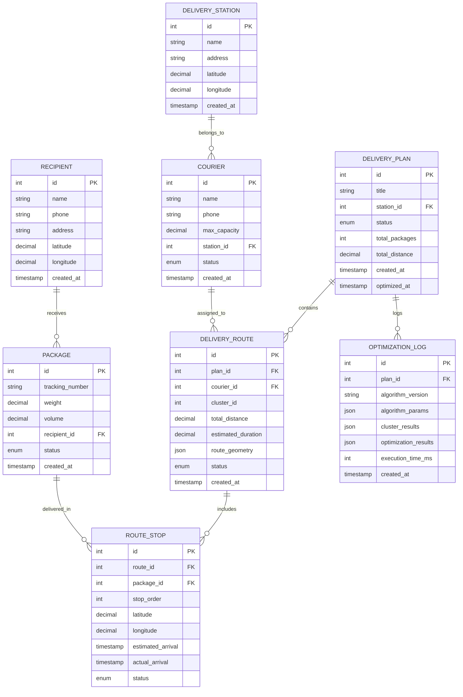
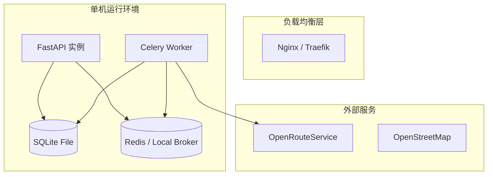
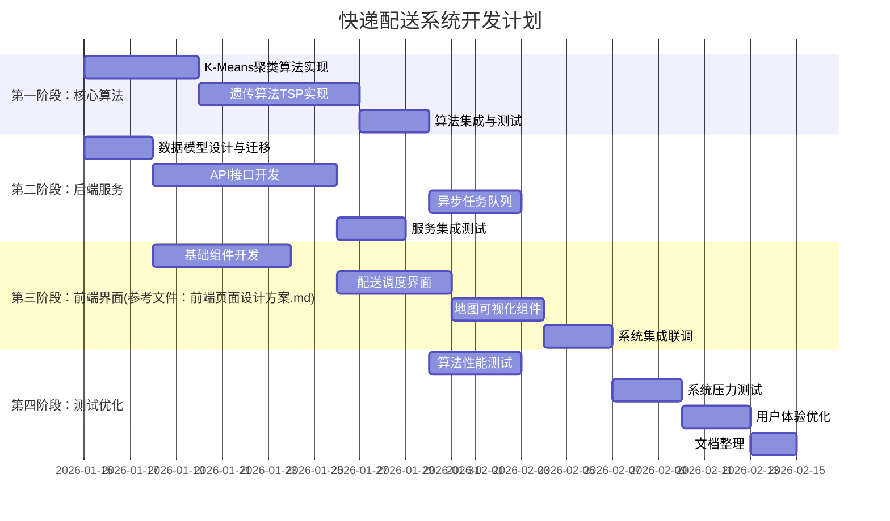

# 基于K-Means聚类与遗传算法的快递末端配送路径规划系统设计文档
> **应用场景**: 快递末端配送路径优化
> **核心算法**: K-Means聚类 + 遗传算法

---

## 目录

1. [问题定义](#1-问题定义)
2. [场景分析](#2-场景分析)
3. [算法设计](#3-算法设计)
4. [系统架构设计](#4-系统架构设计)
5. [数据模型设计](#5-数据模型设计)
6. [技术选型](#6-技术选型)
7. [实现计划](#7-实现计划)

---

## 1. 问题定义

### 1.1 研究背景

随着电商行业的快速发展，快递包裹数量呈指数级增长。快递末端配送作为物流链条的最后一公里，面临着配送效率低、成本高、路径规划不合理等挑战。如何通过算法优化提升配送效率，降低配送成本，成为亟待解决的问题。

### 1.2 问题描述

**核心问题**: 给定一个快递配送站、多个快递员、多个待配送包裹，如何分配包裹并规划配送路径，使得总配送距离最小？

**数学建模**:
- 设有 `n` 个收件地址：`R = {r₁, r₂, ..., rₙ}`
- 设有 `k` 个快递员：`C = {c₁, c₂, ..., cₖ}`
- 设配送站为起点：`D`
- 目标函数：最小化总配送距离 `min Σ distance(route_i)`

**约束条件**:
1. 每个包裹只能分配给一个快递员
2. 每个快递员从配送站出发，最终回到配送站
3. 快递员载货量不能超过容量限制

### 1.3 解决方案概述

采用 **两阶段启发式算法**：
1. **第一阶段 - K-Means聚类**: 将地理分散的收件地址按空间位置聚类成k个区域
2. **第二阶段 - 遗传算法**: 对每个区域内的收件地址，运用遗传算法求解TSP问题

---

## 2. 场景分析

### 2.1 快递末端配送业务流程



### 2.2 业务实体关系

| 实体 | 说明 | 核心属性 |
|------|------|---------|
| **配送站** | 快递配送的起始点和结束点 | 名称、地址、坐标 |
| **快递员** | 执行配送任务的人员 | 姓名、电话、载货容量、当前所在配送站 |
| **包裹** | 待配送的快递包裹 | 快递单号、重量、体积、收件地址 |
| **收件人** | 包裹的接收方 | 姓名、电话、详细地址、坐标 |
| **配送路线** | 快递员的配送路径规划 | 包含的包裹、访问顺序、总距离、预计时长 |

### 2.3 场景特征分析

**为什么快递末端配送适合 K-Means + 遗传算法？**

| 特征 | 说明 | 算法适配性 |
|------|------|-----------|
| **地理聚集性** | 同一小区、同一街道的包裹较多 | ✅ K-Means能很好地识别地理聚集区域 |
| **多快递员并行** | 多个快递员同时工作，互不干扰 | ✅ 聚类天然实现任务并行分割 |
| **路径优化需求** | 减少重复路径，提升配送效率 | ✅ GA适合解决每个区域内的TSP问题 |
| **动态性要求** | 可接受秒级到分钟级的计算时间 | ✅ 算法复杂度可控，实时性较好 |

### 2.4 算法优势分析

**相比纯OR-Tools方案的优势**:
1. **可解释性更强**: K-Means聚类结果直观，便于快递站长理解和调整
2. **适应性更好**: 可根据快递员熟悉区域调整聚类结果
3. **扩展性更强**: 新增快递员时，只需调整K值重新聚类
4. **本土化更强**: 符合国内快递行业"分区配送"的实际操作习惯

---

## 3. 算法设计

### 3.1 整体算法流程



### 3.2 K-Means聚类设计

#### 3.2.1 输入输出

**输入**:
- `recipients`: 收件地址列表 `[(lat₁, lon₁), (lat₂, lon₂), ..., (latₙ, lonₙ)]`
- `k`: 快递员数量
- `depot`: 配送站坐标 `(lat_depot, lon_depot)`

**输出**:
- `clusters`: K个地址聚类 `[cluster₁, cluster₂, ..., clusterₖ]`

#### 3.2.2 距离计算

使用 **Haversine公式** 计算地球表面两点间距离：

```python
def haversine_distance(lat1, lon1, lat2, lon2):
    """
    计算地球表面两点间的距离（公里）
    """
    R = 6371  # 地球半径
    phi1, phi2 = math.radians(lat1), math.radians(lat2)
    dphi = math.radians(lat2 - lat1)
    dlambda = math.radians(lon2 - lon1)

    a = math.sin(dphi/2)**2 + math.cos(phi1) * math.cos(phi2) * math.sin(dlambda/2)**2
    return R * 2 * math.atan2(math.sqrt(a), math.sqrt(1-a))
```

#### 3.2.3 改进的K-Means算法

**标准K-Means的问题**: 不考虑配送站位置，可能导致聚类中心距离配送站很远

**改进方案**: **约束K-Means** - 在聚类时考虑到配送站的位置

```python
def constrained_kmeans_clustering(recipients, k, depot, max_distance_from_depot=50):
    """
    改进的K-Means聚类算法

    Args:
        recipients: 收件地址列表
        k: 聚类数量（快递员数量）
        depot: 配送站坐标
        max_distance_from_depot: 聚类中心距离配送站的最大距离(km)

    Returns:
        clusters: K个地址聚类
        centroids: 聚类中心坐标
    """

    # 1. 初始化聚类中心（在配送站周围）
    initial_centroids = initialize_centroids_around_depot(depot, k, radius=10)

    # 2. 迭代聚类
    for iteration in range(max_iterations):
        # 分配点到最近聚类中心
        clusters = assign_points_to_clusters(recipients, centroids)

        # 更新聚类中心（带约束）
        new_centroids = update_centroids_with_constraint(
            clusters, depot, max_distance_from_depot
        )

        # 检查收敛
        if converged(centroids, new_centroids):
            break

        centroids = new_centroids

    return clusters, centroids
```

### 3.3 遗传算法TSP设计

#### 3.3.1 染色体编码

**编码方式**: 整数编码（路径表示法）
- 染色体 = 收件地址的访问顺序
- 例如: `[3, 1, 4, 2, 5]` 表示访问顺序为 配送站 → 地址3 → 地址1 → 地址4 → 地址2 → 地址5 → 配送站

#### 3.3.2 适应度函数

```python
def fitness_function(chromosome, addresses, depot):
    """
    计算染色体的适应度值
    适应度 = 1 / (总路径距离 + 惩罚项)
    """
    total_distance = 0

    # 配送站到第一个地址
    current_pos = depot

    # 按染色体顺序访问各地址
    for addr_index in chromosome:
        next_pos = addresses[addr_index]
        total_distance += haversine_distance(current_pos, next_pos)
        current_pos = next_pos

    # 最后一个地址回到配送站
    total_distance += haversine_distance(current_pos, depot)

    # 适应度为距离的倒数（距离越短，适应度越高）
    return 1.0 / (total_distance + 1e-6)
```

#### 3.3.3 遗传操作设计

**选择策略**: 锦标赛选择
```python
def tournament_selection(population, fitnesses, tournament_size=3):
    """
    锦标赛选择：随机选择tournament_size个个体，返回适应度最高的
    """
    tournament_indices = random.sample(range(len(population)), tournament_size)
    tournament_fitnesses = [fitnesses[i] for i in tournament_indices]
    winner_idx = tournament_indices[np.argmax(tournament_fitnesses)]
    return population[winner_idx]
```

**交叉策略**: 顺序交叉（OX）
```python
def order_crossover(parent1, parent2):
    """
    顺序交叉：保持部分基因的相对顺序
    """
    size = len(parent1)
    start, end = sorted(random.sample(range(size), 2))

    # 从parent1复制部分基因
    child = [-1] * size
    child[start:end] = parent1[start:end]

    # 从parent2按顺序填充剩余位置
    pointer = end
    for gene in parent2[end:] + parent2[:end]:
        if gene not in child:
            if pointer >= size:
                pointer = 0
            while child[pointer] != -1:
                pointer = (pointer + 1) % size
            child[pointer] = gene
            pointer = (pointer + 1) % size

    return child
```

**变异策略**: 交换变异
```python
def swap_mutation(chromosome, mutation_rate=0.1):
    """
    交换变异：随机交换两个位置的基因
    """
    if random.random() < mutation_rate:
        i, j = random.sample(range(len(chromosome)), 2)
        chromosome[i], chromosome[j] = chromosome[j], chromosome[i]
    return chromosome
```

#### 3.3.4 遗传算法主流程

```python
def genetic_algorithm_tsp(addresses, depot, population_size=100, generations=500):
    """
    遗传算法求解TSP
    """
    # 1. 初始化种群
    population = initialize_population(len(addresses), population_size)

    best_fitness_history = []

    for generation in range(generations):
        # 2. 计算适应度
        fitnesses = [fitness_function(chromo, addresses, depot) for chromo in population]

        # 3. 记录最优解
        best_idx = np.argmax(fitnesses)
        best_fitness_history.append(fitnesses[best_idx])

        # 4. 生成下一代
        new_population = []

        # 保留精英（前10%）
        elite_count = int(0.1 * population_size)
        elite_indices = np.argsort(fitnesses)[-elite_count:]
        new_population.extend([population[i] for i in elite_indices])

        # 交叉和变异生成剩余个体
        while len(new_population) < population_size:
            parent1 = tournament_selection(population, fitnesses)
            parent2 = tournament_selection(population, fitnesses)

            child1 = order_crossover(parent1, parent2)
            child2 = order_crossover(parent2, parent1)

            child1 = swap_mutation(child1)
            child2 = swap_mutation(child2)

            new_population.extend([child1, child2])

        population = new_population[:population_size]

    # 返回最优解
    final_fitnesses = [fitness_function(chromo, addresses, depot) for chromo in population]
    best_chromosome = population[np.argmax(final_fitnesses)]

    return best_chromosome, best_fitness_history
```

### 3.4 算法参数配置

| 参数 | 推荐值 | 说明 |
|------|--------|------|
| **K-Means** | | |
| max_iterations | 100 | 最大迭代次数 |
| tolerance | 1e-4 | 收敛判断阈值 |
| max_distance_from_depot | 50km | 聚类中心距配送站最大距离 |
| **遗传算法** | | |
| population_size | 100 | 种群大小 |
| generations | 500 | 进化代数 |
| crossover_rate | 0.8 | 交叉概率 |
| mutation_rate | 0.1 | 变异概率 |
| elite_ratio | 0.1 | 精英保留比例 |
| tournament_size | 3 | 锦标赛大小 |

---

## 4. 系统架构设计

### 4.1 整体架构图



### 4.2 服务模块设计

#### 4.2.1 配送调度服务

**职责**: 整合聚类和路径优化，生成配送计划

```python
class DeliveryDispatchService:
    """配送调度服务"""

    async def create_delivery_plan(self, packages: List[Package],
                                 couriers: List[Courier],
                                 station: DeliveryStation) -> DeliveryPlan:
        """
        创建配送计划

        流程:
        1. 提取包裹收件地址坐标
        2. K-Means聚类分区域
        3. 分配快递员到区域
        4. 并行执行GA-TSP优化
        5. 生成最终配送计划
        """

    async def optimize_routes_async(self, clusters: List[Cluster],
                                  station: DeliveryStation) -> List[Route]:
        """异步并行优化所有区域路径"""

    async def assign_couriers_to_clusters(self, clusters: List[Cluster],
                                        couriers: List[Courier]) -> Dict:
        """智能分配快递员到聚类区域"""
```

#### 4.2.2 路径优化服务

**职责**: 封装K-Means和GA算法，提供统一的优化接口

```python
class RouteOptimizationService:
    """路径优化服务"""

    def __init__(self):
        self.kmeans_engine = KMeansClusteringEngine()
        self.ga_engine = GeneticAlgorithmEngine()

    async def cluster_delivery_points(self, addresses: List[Address],
                                    k: int,
                                    station: Address) -> List[Cluster]:
        """K-Means聚类"""

    async def optimize_cluster_route(self, cluster: Cluster,
                                   station: Address) -> Route:
        """单个聚类的GA-TSP优化"""

    async def batch_optimize_routes(self, clusters: List[Cluster],
                                  station: Address) -> List[Route]:
        """批量并行优化多个聚类"""
```

#### 4.2.3 算法引擎设计

```python
class KMeansClusteringEngine:
    """K-Means聚类引擎"""

    def cluster(self, points: np.ndarray, k: int,
                depot: Tuple[float, float], **kwargs) -> ClusterResult:
        """执行约束K-Means聚类"""

class GeneticAlgorithmEngine:
    """遗传算法引擎"""

    def solve_tsp(self, addresses: List[Address],
                  depot: Address, **kwargs) -> TSPResult:
        """遗传算法求解TSP"""

class RouteVisualizationEngine:
    """路径可视化引擎"""

    def generate_route_geometry(self, route: Route) -> str:
        """生成路径几何信息（用于地图展示）"""
```

### 4.3 异步处理架构

**大规模配送优化的异步处理机制**:



---

## 5. 数据模型设计

### 5.1 核心实体关系图



### 5.2 状态枚举定义

```python
class PackageStatus(enum.Enum):
    """包裹状态"""
    PENDING = "PENDING"           # 待分配
    ASSIGNED = "ASSIGNED"         # 已分配到路线
    IN_TRANSIT = "IN_TRANSIT"     # 配送中
    DELIVERED = "DELIVERED"       # 已送达
    FAILED = "FAILED"             # 配送失败
    RETURNED = "RETURNED"         # 已退回

class CourierStatus(enum.Enum):
    """快递员状态"""
    AVAILABLE = "AVAILABLE"       # 空闲可分配
    BUSY = "BUSY"                 # 配送中
    OFF_DUTY = "OFF_DUTY"         # 下班

class DeliveryPlanStatus(enum.Enum):
    """配送计划状态"""
    DRAFT = "DRAFT"               # 草稿
    OPTIMIZING = "OPTIMIZING"     # 优化中
    READY = "READY"               # 优化完成，待执行
    IN_PROGRESS = "IN_PROGRESS"   # 执行中
    COMPLETED = "COMPLETED"       # 已完成
    CANCELLED = "CANCELLED"       # 已取消

class RouteStatus(enum.Enum):
    """路线状态"""
    PLANNED = "PLANNED"           # 已规划
    ASSIGNED = "ASSIGNED"         # 已分配
    IN_PROGRESS = "IN_PROGRESS"   # 执行中
    COMPLETED = "COMPLETED"       # 已完成
    PAUSED = "PAUSED"             # 暂停

class StopStatus(enum.Enum):
    """配送点状态"""
    PENDING = "PENDING"           # 待配送
    IN_PROGRESS = "IN_PROGRESS"   # 配送中
    DELIVERED = "DELIVERED"       # 已送达
    FAILED = "FAILED"             # 配送失败
    SKIPPED = "SKIPPED"           # 跳过
```

### 5.3 关键字段说明

#### 5.3.1 DELIVERY_ROUTE 表

| 字段 | 类型 | 说明 |
|------|------|------|
| cluster_id | int | K-Means聚类编号（0-K） |
| route_geometry | json | ORS编码的路径几何信息 |
| estimated_duration | decimal | 预计配送时长（分钟） |

**route_geometry 结构示例**:
```json
{
  "encoded_polyline": "u{~vFvyys@fS]",
  "coordinates": [[116.397, 39.916], [116.398, 39.917]],
  "total_distance": 1250.5,
  "segments": [
    {"distance": 500.2, "duration": 120},
    {"distance": 750.3, "duration": 180}
  ]
}
```

#### 5.3.2 OPTIMIZATION_LOG 表

用于记录算法执行过程，便于调试和优化：

**algorithm_params 结构示例**:
```json
{
  "kmeans": {
    "k": 5,
    "max_iterations": 100,
    "tolerance": 1e-4,
    "max_distance_from_depot": 50
  },
  "genetic_algorithm": {
    "population_size": 100,
    "generations": 500,
    "crossover_rate": 0.8,
    "mutation_rate": 0.1,
    "tournament_size": 3
  }
}
```

**cluster_results 结构示例**:
```json
{
  "clusters": [
    {
      "cluster_id": 0,
      "centroid": [116.397, 39.916],
      "points": [1, 3, 5, 7],
      "intra_cluster_distance": 125.3
    }
  ],
  "total_inertia": 1250.8,
  "iterations": 15
}
```

---

## 6. 技术选型

### 6.1 技术栈选择

| 层级 | 技术选型 | 理由 |
|------|----------|------|
| **前端框架** | Vue 3 + TypeScript | 响应式、组件化、类型安全 |
| **UI组件库** | Element Plus | 丰富的企业级组件 |
| **地图组件** | Leaflet + OpenStreetMap | 开源、轻量、扩展性强 |
| **状态管理** | Pinia | Vue 3 官方推荐 |
| **后端框架** | FastAPI + Python + uv | 高性能、自动文档、类型检查 |
| **数据库** | SQLite | 轻量级、零配置、本地单文件存储，适合当前项目数据规模 |
| **任务队列** | Celery | Python生态成熟的异步任务 |
| **缓存/Broker** | Redis / SQLite | 高性能任务中转（支持本地 SQLite 模式） |
| **科学计算** | NumPy + Pandas | 数值计算、数据处理 |
| **机器学习** | scikit-learn | K-Means算法实现 |
| **地图服务** | OpenRouteService | 开源、功能完整 |
| **部署方式** | 本地运行 / Docker | 支持轻量化部署 |

### 6.2 核心依赖库

#### 6.2.1 后端依赖 (requirements.txt)

```txt
# Web框架
fastapi==0.104.1
uvicorn==0.24.0
pydantic==2.5.0

# 数据库
sqlalchemy==2.0.23
alembic==1.12.1

# 异步任务
celery==5.3.4
redis==5.0.1
kombu-sqlalchemy==1.1.0  # 可选：用于支持 SQLite 作为 Broker

# 科学计算
numpy==1.24.3
pandas==2.0.3
scikit-learn==1.3.0

# 地图服务
openrouteservice==2.3.3
geopy==2.3.0

# 工具库
pydantic-settings==2.0.3
python-jose==3.3.0
passlib==1.7.4
python-multipart==0.0.6
```

#### 6.2.2 前端依赖 (package.json)

```json
{
  "dependencies": {
    "vue": "^3.3.4",
    "vue-router": "^4.2.4",
    "pinia": "^2.1.6",
    "element-plus": "^2.4.2",
    "@element-plus/icons-vue": "^2.1.0",
    "leaflet": "^1.9.4",
    "leaflet-ant-path": "^1.3.0",
    "axios": "^1.5.0",
    "echarts": "^5.4.3",
    "vue-echarts": "^6.6.1"
  },
  "devDependencies": {
    "@vitejs/plugin-vue": "^4.3.4",
    "vite": "^4.4.5",
    "typescript": "^5.1.6",
    "@vue/tsconfig": "^0.4.0"
  }
}
```

### 6.3 部署架构



---

## 7. 实现计划

### 7.1 开发阶段划分



### 7.2 第一阶段：核心算法实现

#### 7.2.1 优先级安排

1. **K-Means聚类算法** 
   - [ ] 实现标准K-Means算法
   - [ ] 添加配送站距离约束
   - [ ] Haversine距离计算
   - [ ] 聚类结果可视化验证

2. **遗传算法TSP** 
   - [ ] 染色体编码设计
   - [ ] 适应度函数实现
   - [ ] 选择、交叉、变异算子
   - [ ] 算法参数调优

3. **算法集成** 
   - [ ] 两阶段算法流程整合
   - [ ] 性能基准测试
   - [ ] 算法效果验证

#### 7.2.2 验证数据准备

**上海市测试数据集**:
- 配送站：上海市浦东新区某快递点
- 收件地址：100个真实上海地址（覆盖浦东、黄浦、静安等区）
- 快递员数量：5人
- 预期聚类效果：按行政区域自然聚类

**测试指标**:
- 算法运行时间：< 30秒 (100个包裹)
- 路径优化效果：比随机路径减少25%+距离
- 聚类合理性：同一聚类内平均距离 < 5km

### 7.3 关键技术风险与应对

| 风险点 | 影响程度 | 应对策略 |
|--------|----------|---------|
| **K-Means初值敏感** | 高 | 多次随机初始化取最优结果 |
| **遗传算法收敛速度** | 中 | 调整种群大小和进化代数 |
| **大规模数据计算性能** | 高 | 分布式计算+异步处理 |
| **地图服务稳定性** | 中 | 备用地图服务+离线计算 |
| **实时性要求** | 中 | 缓存优化+算法参数调优 |

### 7.4 质量保证措施

#### 7.4.1 算法验证

1. **基准测试**: 与OR-Tools、Google优化工具对比
2. **真实数据验证**: 使用实际快递数据验证效果
3. **可视化验证**: 地图上直观展示聚类和路径合理性

#### 7.4.2 系统测试

1. **单元测试**: 每个算法模块独立测试
2. **集成测试**: 端到端业务流程测试
3. **性能测试**: 并发用户、大数据量压力测试
4. **兼容测试**: 不同浏览器、设备适配测试

---
